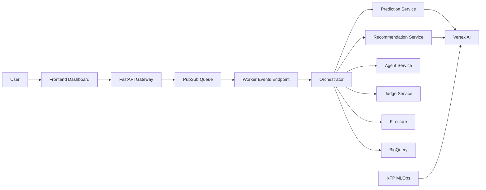
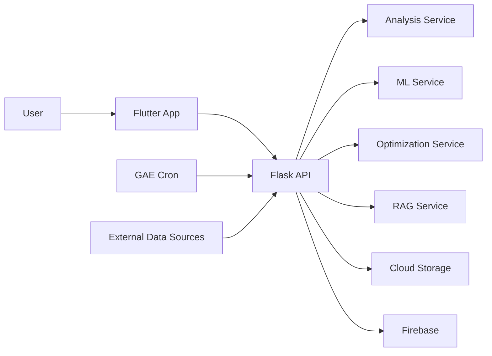
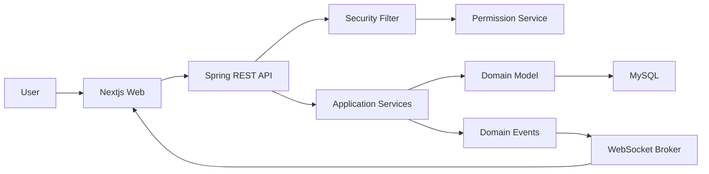
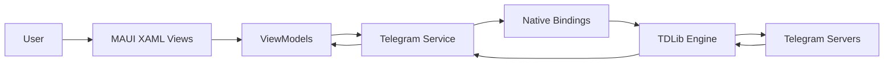
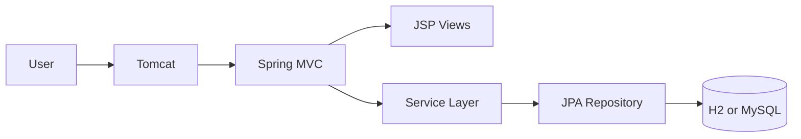

# Achilles Code Portfolio

> 面向中高级面试的工程化项目合集。该仓库覆盖 AI Agent 系统、MLOps、数学优化、实时协作平台、跨端客户端与传统 Java Web 工程。
>
> 核心目标是展示“可运行、可演进、可运维”的工业级交付能力，而不是单点 Demo。

---

## 1. 仓库定位与面试价值

### 1.1 你能从这个仓库看到什么

- 端到端能力：从产品界面、后端服务、数据工程到模型训练和部署。
- 架构能力：异步事件驱动、实时同步、方法级权限、模型服务化、流水线化重训练。
- 工程能力：模块分层、测试覆盖、部署脚本、健康检查、配置治理思维。
- 业务落地能力：每个项目都对应真实业务场景，不是抽象算法练习。

### 1.2 技术广度总览

| 维度 | 技术 |
|---|---|
| 语言 | Python, TypeScript, Java, Dart, C# |
| 后端框架 | FastAPI, Flask, Spring Boot 3.5, Spring MVC 6 |
| 前端框架 | Next.js 16, React 19, Flutter, .NET MAUI |
| AI/ML | LangGraph, LangChain, PyTorch, TensorFlow, scikit-learn, SHAP, LightGBM, XGBoost |
| 数据与存储 | BigQuery, Firestore, Firebase Auth, MySQL, H2, Redis |
| 实时与消息 | Apache Beam, Pub/Sub, WebSocket(STOMP/SockJS) |
| 工程化 | Docker, Docker Compose, Maven, pytest, JUnit5, Cloud Run, App Engine |

---

## 2. 项目矩阵

| 项目 | 场景 | 技术关键词 | 成熟度 |
|---|---|---|---|
| [SentinEL](./SentinEL) | AI 客户留存决策 | Agent 编排、实时特征、推荐、MLOps | 高 |
| [data science](./data%20science) | 能源预测与调度优化 | 预测+优化、云任务、可解释性 | 高 |
| [aether](./aether) | 实时协作看板 | 权限模型、事件驱动、拖拽协作 | 中高 |
| [MyTelegramApp](./MyTelegramApp) | 跨端即时通信客户端 | MAUI、TDLib、授权状态机 | 中 |
| [java/web](./java/web) | 传统 Java Web 样板 | Spring MVC + JPA + WAR | 中 |
| [genui](./genui) | 生成式 UI SDK 实验 | 动态 UI 运行时、A2UI 协议适配 | 研究型 |

---

## 3. 项目深度档案（逐项目扩写）

## 3.1 SentinEL：企业级 AI 客户留存系统

### 3.1.1 业务问题定义

目标是把“用户流失预警”从离线报表升级为在线决策系统：
- 实时识别高风险用户。
- 生成个性化挽留策略。
- 输出可执行干预内容（邮件/脚本/语音）。
- 记录全流程状态并支持审计。
- 通过 MLOps 形成持续优化闭环。

### 3.1.2 系统分层技术栈

| 分层 | 技术与职责 | 关键文件 |
|---|---|---|
| 前端 Command Center | Next.js 16 + React 19 + TS + Tailwind + Recharts + Framer Motion，展示风险仪表、策略、Agent 推理、活动流 | `SentinEL/frontend/src/app/dashboard/page.tsx` |
| API 网关层 | FastAPI 路由聚合，区分对外接口与内部 worker 接口 | `SentinEL/backend/app/main.py` |
| Agent 编排层 | LangGraph + ReAct Tool 调用，支持反馈重试 | `SentinEL/backend/app/agents/sentinel_agent.py` |
| 核心业务编排层 | orchestrator 串联预测、推荐、Agent、Judge、持久化 | `SentinEL/backend/app/services/orchestrator.py` |
| 预测层 | Vertex Endpoint 推理 + Feature Store 实时特征 + fallback 策略 | `SentinEL/backend/app/services/prediction_service.py` |
| 推荐层 | User Tower embedding + Matching Engine 向量检索 | `SentinEL/backend/app/services/recommendation_service.py` |
| 数据层 | BigQuery、Firestore、Pub/Sub、Redis(可选) | `SentinEL/backend/app/services/*` |
| 数据工程层 | Apache Beam 流处理构建在线特征 | `SentinEL/data_engineering/streaming_pipeline.py` |
| MLOps 层 | KFP v2 + Vertex Pipeline 触发重训、评估、发布 | `SentinEL/backend/mlops/*` |

#### 技术栈详解

- 前端框架：
  `Next.js 16.1.1 + React 19.2.3 + TypeScript 5` 作为主 UI 容器，适合做组件化仪表盘与状态驱动页面；在当前项目中承载风险面板、策略展示、Agent 推理日志和实时活动流。
- UI 组件与交互：
  `TailwindCSS 3.4` 负责快速构建高密度后台界面；`Radix UI`（Avatar、Dialog、Dropdown、Progress、Toast 等）提供稳定的无头交互组件；`framer-motion` 负责状态切换动画和面板动态反馈，提升 AI 产品的“实时感”。
- 可视化：
  `Recharts` 用于风险评分、趋势展示和策略效果可视化，适合快速构建业务图表并和 React 状态联动。
- 前端数据能力：
  `firebase` Web SDK 用于连接 Firestore 实时监听，使前端可以在分析任务执行过程中持续接收状态更新，而不是等待接口一次性返回最终结果。
- API 框架：
  `FastAPI 0.111.0 + uvicorn[standard] 0.29.0` 组合适合高并发 I/O 型服务，当前项目主要承担 API 聚合、异步任务入口、内部 worker 回调端点与健康检查。
- 配置与基础设施：
  `pydantic-settings 2.2.1` 用于环境配置加载；`python-dotenv 1.0.1` 支撑本地开发环境变量注入；`firebase-admin 6.5.0` 用于 Firestore/配置集成；`redis 5.0.4` 用于热点分析缓存与降本。
- LLM / Agent 框架：
  `langchain 0.1.20`、`langchain-core 0.1.52`、`langchain-community 0.0.38` 负责工具调用与模型抽象；`langgraph 0.0.50` 负责状态化 Agent 工作流；`langchain-google-vertexai` 将 Agent 执行与 Vertex AI 模型接通。
- 模型与推理：
  `tensorflow 2.16.1` 和 `tensorflow-recommenders 0.7.3` 用于推荐与部分推理链路；`torch >= 2.3.0` 用于深度模型训练与部署（LSTM / Transformer）；`vertexai` / `google-cloud-aiplatform` 用于在线推理、Endpoint 管理与 Vertex Pipeline 交互。
- 数据与云服务：
  `google-cloud-bigquery` 用于离线画像与策略检索；`google-cloud-firestore` 用于分析状态与审计记录；`google-cloud-pubsub` 用于异步任务解耦；`google-cloud-storage` 用于训练产物与中间结果；`google-cloud-texttospeech` 用于生成语音干预内容。
- 数据工程：
  `apache-beam[gcp] 2.61.0` 负责实时行为流处理，适合做在线特征聚合（例如短时会话行为、点击异常等）。
- MLOps：
  `kfp >= 2.7.0` 和 `google-cloud-pipeline-components >= 2.13.0` 用于构建“重训练 -> 评估 -> 注册 -> 发布”的标准化流水线。
- 可观测性：
  `opentelemetry-api/sdk` 与 `opentelemetry-exporter-gcp-trace` 负责链路追踪接入，为后续定位慢调用、失败节点和外部依赖瓶颈提供基础。

##### 选型逻辑与工业级价值

- 前后端职责拆分清晰：
  `Next.js` 负责操作台式 UI、实时状态呈现和高密度信息展示，`FastAPI` 负责异步 I/O、接口聚合和任务入口；这种拆分让前端可以独立迭代交互体验，后端则专注于推理编排与服务集成，符合工业项目常见的“控制台 + 智能服务”模式。
- 确定性逻辑与 Agent 推理隔离：
  `LangGraph` 被放在 Agent 状态流层，而预测、推荐、编排服务仍保留为显式 Python service；这意味着 LLM 负责“解释、决策建议、工具调度”，核心风险评分、推荐召回、状态落库仍走可审计代码路径，避免把关键业务逻辑完全交给黑盒模型。
- 在线链路与离线链路分层：
  `Pub/Sub + Beam + Firestore` 负责高频事件、实时特征和任务状态，`BigQuery + GCS` 负责离线分析、训练集和历史检索；这类冷热分层是工业数据平台的常见做法，既控制在线读写成本，也保证训练和分析不会反向拖慢线上服务。
- AI 产品闭环完整：
  这套栈同时覆盖了前端交互、在线推理、实时特征、流处理、模型发布和可观测性，已经不是“单个模型 demo”，而是接近企业级智能应用的完整技术闭环，对面试官最有说服力的点在于链路完整性而不是单点算法。
- 当前取舍非常明确：
  深度绑定 `GCP/Vertex` 的代价是云厂商耦合较高，但换来的收益是可以快速搭建从训练到上线的统一平台；如果后续走多云或本地化部署，再抽象模型网关、事件总线和特征存储接口即可。

### 3.1.3 对外接口与内部接口能力

核心路由分组（均在 `SentinEL/backend/app/api/v1/endpoints/`）：
- `analysis.py`：`/analyze` 异步入队、`/analyze/{analysis_id}` 状态查询、`/feedback` 反馈、`/analyze-competitor` 多模态竞品分析。
- `recommendations.py`：`/recommendations/{user_id}` 个性化策略推荐。
- `agent.py`：`/analyze_flow` 输出 Agent trace。
- `mlops.py`：`/retrain` 触发重训、`/audit-logs` 审计日志。
- `pipeline.py`：`/run_data_pipeline` 数据工厂流水线任务。
- `events.py`：`/events/process` Pub/Sub push worker 内部消费端点。

### 3.1.4 关键链路（可作为面试讲述主线）

1. 前端调用 `/api/v1/analyze`。
2. 后端创建 Firestore 记录（`QUEUED`）并写入 Pub/Sub。
3. Worker 端点 `/api/v1/events/process` 消费消息，状态改为 `PROCESSING`。
4. Orchestrator 执行：用户画像 -> 实时特征 -> 深度预测 -> 推荐 -> Agent -> Judge 反馈循环。
5. 结果写回 Firestore（`COMPLETED`/`FAILED`），前端通过监听与轮询更新 UI。
6. 反馈和审计数据沉淀，用于后续模型与策略迭代。

### 3.1.5 工程化实现亮点

- 异步架构：请求快速返回 `202`，重计算链路异步化，避免前端阻塞。
- 状态可观测：Firestore 逐步更新，能展示到步骤级状态与评分。
- 策略质量控制：Judge 评分 + 重试机制，提升生成内容稳定性。
- 预测双路径：深度模型优先，失败回退到 BigQuery/默认路径。
- 实验能力：CRC32 确定性分流实现 A/B 可复现性。
- 部署自动化：Cloud Run 前后端一键脚本，支持环境注入。

### 3.1.6 可继续增强点（主动体现工程判断）

- 对 worker 链路增加幂等键与重复消费保护。
- 补齐端到端自动化测试与性能压测基线。
- 将策略推荐映射与评估指标持久化，形成在线实验看板。

### 3.1.7 面试官可感知价值（一句话）

这不是“调一个大模型 API”，而是一个带实时特征、异步调度、质量闭环和 MLOps 的可上线 AI 决策系统。

### 3.1.8 核心数据对象与状态机

- `analysis_logs`（Firestore）承载链路主记录，字段覆盖 `status`、`risk_level`、`churn_probability`、`judge_history`、`generated_email`、`experiment_group` 等。
- 状态流转遵循：`QUEUED -> PROCESSING -> COMPLETED/FAILED`，并在每一步更新 `updated_at`。
- 步骤级日志通过 `update_step` 写入，前端可展示“预测中/Agent 推理中/Judge 审核中”等细粒度进度。
- 审计维度数据与业务结果同源保存，便于后续离线复盘与实验效果分析。

### 3.1.9 稳定性与故障处理策略

- API 层优先保证“可追踪”而非“同步完成”，通过 202 + analysis_id 避免长链路超时。
- Worker 执行异常会写入 `FAILED` 和 `error_message`，确保故障可见且可定位。
- 深度预测、Feature Store、向量检索任一环节失败时允许降级，避免整条链路不可用。
- 对外部依赖调用统一日志记录，便于定位延迟热点和错误来源。

### 3.1.10 性能与成本优化策略

- 对高频分析结果启用 TTL 缓存，降低重复计算与云推理成本。
- 通过 A/B 分流控制高成本模型流量占比，在质量与成本之间动态平衡。
- 采用异步队列处理重任务，提高前端响应速度和吞吐稳定性。
- 实时特征流处理降低全量重算频率，提升时效性并控制计算开销。

### 3.1.11 未来演进路线

- 增加消息幂等键与重复消费保护，进一步提升队列处理鲁棒性。
- 建立 SLO 指标（分析完成时延、失败率、重试率）并接入告警。
- 补充端到端回放测试，验证从入队到结果写回的全链路稳定性。

---

## 3.2 data science：智能能源预测与调度优化平台

### 3.2.1 业务问题定义

在电价波动场景下，目标是利用电池储能进行削峰填谷和成本最优调度：
- 预测未来负荷。
- 结合电价和设备约束求解最优充放电策略。
- 通过可视化界面进行 What-if 分析与策略解释。

### 3.2.2 系统分层技术栈

| 分层 | 技术与职责 | 关键文件 |
|---|---|---|
| 前端交互层 | Flutter + Firebase Auth + fl_chart，支持建模、分析、历史、DL、RAG 页面 | `data science/front/lib/screens/*` |
| API 层 | Flask + gunicorn + CORS + 统一鉴权/限流 | `data science/back/main.py`, `data science/back/api/*` |
| 预测层 | scikit-learn + LightGBM + XGBoost + Optuna，自动模型比较 | `data science/back/services/ml_service.py` |
| 优化层 | gurobipy MIP，支持功率/能量/互斥/防逆流等约束 | `data science/back/services/optimization_service.py` |
| 数据分析层 | pandas + 统计分析 + 质量检查 + 相关性分析 | `data science/back/api/analysis.py`, `data science/back/services/analysis_service.py` |
| 可解释层 | SHAP 特征贡献解释 | `data science/back/services/explainability_service.py` |
| 漂移监控层 | PSI / KL 数据分布漂移检测 | `data science/back/services/drift_service.py` |
| 文档问答层 | RAG 文档入库与问答 | `data science/back/api/rag.py` |
| 云运维层 | App Engine 自动扩缩容 + Cron 定时任务 + Secret Manager | `data science/back/app.yaml`, `data science/back/cron.yaml` |

#### 技术栈详解

- 前端框架：
  `Flutter + Dart 3.10` 作为统一前端实现，适合同时覆盖 Web 与跨端形态；当前项目将建模、分析、历史、RAG 等模块统一在一个多页面应用中。
- 前端状态与 UI 生态：
  `firebase_core` 与 `firebase_auth` 负责登录态；`fl_chart` 负责图表展示；`percent_indicator` 用于成本节省、SOC 比例等业务型指标可视化；`google_fonts`、自定义主题系统则用于统一产品风格。
- HTTP 与文件能力：
  `http` 和 `http_parser` 负责 API 调用与上传；`file_picker` 支撑 CSV/Excel 文件上传入口，是数据分析场景的关键交互基础。
- API 框架：
  `Flask 3.0.0 + gunicorn 21.2.0 + flask-cors 4.0.0` 构成轻量但可部署的服务层，适合承载分析、训练、优化、RAG 这些相对独立的业务端点。
- 数据科学基础：
  `pandas`、`numpy`、`scipy` 是整个数据处理、特征工程和统计分析的底座；`openpyxl` 使 Excel 文件可直接进入分析链路。
- 机器学习建模：
  `scikit-learn 1.3.2` 负责传统 ML pipeline；`lightgbm` 与 `xgboost` 用于提升树模型对比；`optuna` 用于自动调参与模型选择，使训练不再依赖纯手工试参。
- 模型解释与监控：
  `shap 0.44.1` 用于特征重要性和单样本解释；漂移检测通过项目自实现的 `PSI / KL` 逻辑补足线上模型健康监控。
- 优化求解：
  `gurobipy 10.0.3` 是核心求解器，负责把负荷预测和电价输入转化为“可执行”的电池调度方案，是该项目最关键的工业化能力之一。
- 数据采集与任务调度：
  `gridstatus` 用于能源数据源接入；`apscheduler 3.10.4` 负责本地/服务内调度；在云上则通过 `GAE Cron` 做定时触发。
- 云与配置：
  `firebase-admin 6.5.0` 支撑鉴权和存储协同；`google-cloud-secret-manager` 用于敏感配置安全托管；`python-dotenv` 负责本地环境开发便利性。
- 运维部署：
  `Google App Engine` 的 `app.yaml` 负责实例规格、自动扩缩容、入口命令；`cron.yaml` 负责定时数据抓取和定时重训，是该项目稳定运行的关键组成。

##### 选型逻辑与工业级价值

- 前端选型强调“产品化交付”而不是 notebook 演示：
  `Flutter` 让同一套界面逻辑可覆盖 Web 和跨端形态，比单纯用前端模板页更适合把分析、建模、历史记录、RAG 等能力整合成一个完整产品；这说明项目关注的是“业务可用性”，不是只做算法脚本。
- 后端选型强调“科学计算兼容性”：
  `Flask + gunicorn` 对科学计算类依赖的兼容性和部署门槛都更友好，尤其在 `pandas / scikit-learn / gurobipy` 这类 CPU 密集型、同步调用明显的场景下，轻量 API 容器往往比引入更复杂的异步框架更务实。
- 预测与优化被明确拆成两层：
  `scikit-learn / LightGBM / XGBoost` 负责回答“未来负荷会怎样”，`gurobipy` 负责回答“在约束下应如何调度”；这是一套典型的工业能源系统思路，即把预测问题和决策问题分离，形成“预测 + 优化”的可落地闭环。
- 可解释性与漂移监控不是附属功能：
  `SHAP`、`PSI`、`KL` 被放进主链路，意味着项目已经考虑到模型上线后的解释需求和分布漂移问题，这比只展示训练精度更接近真实工业系统的治理方式。
- 部署策略偏向低运维成本：
  `App Engine + Cron + Secret Manager` 这套组合降低了手工运维负担，适合中小规模业务先跑起来；代价是复杂长任务和高强度推理会受到平台约束，若规模扩大，自然的下一步是将训练与重计算任务拆到 `Cloud Run` 或独立 worker。

### 3.2.3 API 能力拆解

- 分析路由：`/api/analysis/analyze-csv`、`analyze-excel`，支持质量、相关性、统计检验与历史记录。
- 训练路由：`/api/ml/train`，包含参数校验、资源控制、模型持久化与训练历史。
- 优化路由：`/api/optimization/run`，输入电池参数、初始 SOC、目标日期后返回调度与节省结果。
- RAG 路由：`/api/rag/status`、`ingest`、`ask`，支持文档索引与问答。
- 任务路由：`/tasks/fetch-data`、`/tasks/train-model`，由 GAE Cron 触发。

### 3.2.4 优化模型工程细节

优化器显式建模以下约束：
- 互斥约束：同一时刻不能同时充电和放电。
- 功率约束：充放电功率上限。
- 能量守恒：电池状态随时间演化。
- SOC 边界：设备安全范围。
- 防逆流约束：避免向电网反送电。
- 求解参数：`TimeLimit` 和 `MIPGap` 控制时延与近似精度平衡。

### 3.2.5 前端产品化能力

Flutter 端不仅是图表展示，还包含：
- 认证包装器（登录态自动切换页面）。
- 主导航分模块（能源优化、数据分析、历史）。
- 优化沙盒（电池容量、功率、温度偏置、场景模拟）。
- 解释性展示（特征重要性、策略细节、诊断信息）。

### 3.2.6 工程化实现亮点

- 预测与优化解耦但链路闭环，输出直接是可执行策略。
- 对长耗时任务进行资源/超时控制，考虑云环境限制。
- 任务触发具备来源校验（Cron Header），减少误调用风险。
- 测试目录完备：API、服务、工作流、认证、MLOps 多层验证。

### 3.2.7 已记录指标（项目文档）

- 最优模型：LightGBM_300。
- `R² = 0.9716`。
- `MAPE = 1.40%`。
- 25 维特征工程。

### 3.2.8 面试官可感知价值（一句话）

该项目实现了“预测模型 -> 约束优化 -> 可视化决策”的工业闭环，而不是单纯做一个回归模型。

### 3.2.9 核心数据对象与任务编排

- 数据对象覆盖上传数据、特征处理结果、训练产物、优化结果、历史记录五类。
- `HistoryService` 统一记录关键操作，为问题回溯和用户行为分析提供依据。
- App Engine Cron 负责任务触发，后端任务端点负责执行和结果状态更新。
- 前端通过模块化页面承接分析、优化、历史、深度学习和 RAG 场景。

### 3.2.10 求解器工程实践细节

- 优化模型显式声明互斥、功率、SOC、防逆流等约束，保证方案可执行。
- 对输入负载规模与单位做前置校验，减少异常数据导致的伪最优解。
- 通过 `TimeLimit` 与 `MIPGap` 在求解精度与响应时延之间做工程化平衡。
- 结果中保留策略细节和诊断信息，支持用户理解“为什么是这个调度方案”。

### 3.2.11 可靠性与资源治理

- 对训练、分析等重任务设置限流策略，防止资源被瞬时耗尽。
- 数据加载与模型训练过程中显式内存清理，降低云环境 OOM 风险。
- 可解释性和漂移检测模块与主链路解耦，避免非关键能力拖垮核心服务。
- 任务来源校验（Cron Header）降低被外部误触发的可能性。

### 3.2.12 未来演进路线

- 将训练与优化执行抽象为异步作业队列，提升高并发下稳定性。
- 引入模型版本回滚与灰度发布机制，控制变更风险。
- 增加“预测变化 -> 优化变化 -> 成本变化”的自动回归验证。

---

## 3.3 aether：实时协作看板系统（Spring Boot + Next.js）

### 3.3.1 业务问题定义

面向团队协作，提供项目、看板、列表、卡片的全流程管理，并保证权限和实时同步。

### 3.3.2 后端架构分层

| 分层 | 技术与职责 | 关键文件 |
|---|---|---|
| 接口层 | REST API 入口，项目/看板/卡片 CRUD 与成员管理 | `aether/src/main/java/org/xzq/aether/interfaces/rest/*Controller.java` |
| 应用服务层 | 编排业务流程，发布领域事件 | `aether/src/main/java/org/xzq/aether/application/service/*` |
| 领域层 | Project/Board/Card/CardList 聚合和业务行为 | `aether/src/main/java/org/xzq/aether/domain/*` |
| 安全层 | Firebase Token 过滤 + Spring Security 上下文 + 方法级授权 | `aether/src/main/java/org/xzq/aether/application/security/FirebaseTokenFilter.java`, `aether/src/main/java/org/xzq/aether/infrastructure/config/SecurityConfig.java` |
| 权限层 | SpEL 权限服务，项目角色与资源级校验 | `aether/src/main/java/org/xzq/aether/application/security/PermissionService.java` |
| 实时层 | WebSocket + STOMP，监听领域事件并广播 | `aether/src/main/java/org/xzq/aether/infrastructure/config/WebSocketConfig.java`, `aether/src/main/java/org/xzq/aether/infrastructure/websocket/WebSocketNotifierService.java` |
| 持久化层 | JPA/Hibernate/MySQL | `aether/pom.xml`, `aether/src/main/resources/application.properties` |

#### 技术栈详解

- 后端框架：
  `Spring Boot 3.5.7` 作为基础运行时，提供自动装配与生产级启动能力；`spring-boot-starter-web` 用于 REST API，适合承载项目/看板/卡片等标准资源型接口。
- 数据访问：
  `spring-boot-starter-data-jpa` + `Hibernate` 用于领域对象持久化；配合 `MySQL` 形成典型企业级 CRUD + 聚合关系结构。
- 安全体系：
  `spring-boot-starter-security` 提供安全过滤链；`firebase-admin 9.2.0` 用于验证 Firebase Token 并同步用户身份；`@EnableMethodSecurity` + `@PreAuthorize` 用于方法级资源授权。
- 输入校验：
  `spring-boot-starter-validation` 负责请求 DTO 的参数校验，避免非法数据直接进入领域层。
- 实时通信：
  `spring-boot-starter-websocket` 提供 WebSocket 基础设施；在项目中通过 STOMP 主题广播实现看板级实时同步。
- 文档与调试：
  `springdoc-openapi-starter-webmvc-ui 2.3.0` 提供 Swagger/OpenAPI 文档，适合接口自查与联调。
- 前端框架：
  `Next.js 16.0.1 + React 19.2.0 + TypeScript 5` 用于构建现代管理后台式前端，适合承载页面路由、认证态和复杂交互。
- 前端状态管理：
  `zustand 5.0.8` 用于维护 board 全量状态、乐观更新和 WebSocket 客户端实例，避免过度复杂的全局状态样板代码。
- 拖拽系统：
  `@dnd-kit/core`、`@dnd-kit/sortable`、`@dnd-kit/utilities` 负责列表和卡片拖拽，是看板系统交互的核心依赖。
- 实时前端通信：
  `@stomp/stompjs` + `sockjs-client` 负责浏览器侧的主题订阅与断线重连能力，使前端可接收后端实时广播。
- 网络与鉴权：
  `axios` 用于 API 封装；`firebase` Web SDK 用于登录与 token 获取，再由 `apiClient` 统一注入到请求头。
- UI 基础：
  `lucide-react` 提供图标能力；`tailwindcss 4` 负责样式基础。
- 本地部署：
  `docker-compose` 将 API 与 MySQL 打包成一套可复制的本地运行环境，方便演示和协作。

##### 选型逻辑与工业级价值

- 后端采用“先单体、后拆分”的稳健路线：
  `Spring Boot + JPA + MySQL` 非常适合看板协作这种资源关系明确、事务边界清晰的业务，先把项目、成员、列表、卡片这些核心领域稳定下来，再决定是否拆微服务，比一开始就追求复杂分布式架构更符合工程常识。
- 身份认证与资源授权被刻意分层：
  `Firebase` 负责用户身份可信接入，`Spring Security + PermissionService + SpEL` 负责项目级资源授权；这种组合把“你是谁”和“你能做什么”分离开，既保留外部身份平台的便利，也保留业务侧权限模型的可控性。
- 实时同步架构具有扩展空间：
  `领域事件 -> WebSocket/STOMP -> 前端订阅` 这条链路比前端轮询更接近协同产品的正确做法，也为后续补充审计日志、通知中心、操作回放等能力留下了天然扩展点。
- 前端栈是围绕协同交互场景选的：
  `Next.js` 负责页面组织和路由，`zustand` 负责轻量全局状态，`dnd-kit` 负责拖拽交互，`STOMP/SockJS` 负责实时感知；这套栈组合说明你不是在做普通后台 CRUD，而是在做“强交互 + 多人协同”的产品。
- 工程取舍清楚：
  当前方案的优势是交付快、结构清晰、演示完整；代价是当项目规模增大后，实时广播、权限校验和写热点都可能集中在单体服务上，届时再拆事件总线、缓存层和读写分离会更合理。

### 3.3.3 API 能力（按资源划分）

- ProjectController：项目创建、查询、更新、删除、成员管理、项目看板查询。
- BoardController：看板创建/详情/更新/删除，列表创建与顺序更新。
- CardController：卡片创建/更新/删除、拖拽移动、指派与取消指派、我的卡片。

### 3.3.4 权限模型

项目角色：`OWNER / ADMIN / MEMBER`。
权限控制特性：
- `@PreAuthorize` + `PermissionService` 执行资源级校验。
- `isProjectMember / isProjectOwner / isProjectAdminOrOwner / isBoardMember / canEditCard` 等策略函数。
- Token 认证失败返回 `401`，并清空安全上下文。

### 3.3.5 实时协作模型

- 业务操作后发布领域事件（如 `CardMovedEvent`）。
- WebSocket 通知服务异步监听并广播到主题：`/topic/board/{boardId}`、`/topic/project/{projectId}`。
- 前端 store 订阅后进行本地状态同步，形成多端实时一致体验。

### 3.3.6 前端架构与交互实现

| 模块 | 技术与职责 | 关键文件 |
|---|---|---|
| 页面层 | Next.js App Router，认证页与主应用页分区 | `aether/aether-web/src/app/*` |
| 状态层 | Zustand 管理 board 状态、乐观更新、WebSocket 客户端 | `aether/aether-web/src/store/boardStore.ts` |
| 拖拽层 | dnd-kit 实现列表和卡片拖拽 | `aether/aether-web/src/components/board/BoardContainer.tsx` |
| 网络层 | axios API client + Firebase token 注入 | `aether/aether-web/src/lib/apiClient.ts` |
| 实时层 | STOMP/SockJS 订阅事件并分发更新 | `aether/aether-web/src/store/boardStore.ts` |

### 3.3.7 工程化亮点

- 认证闭环：Firebase token 验证 + 本地用户同步 + Spring Security Principal。
- 权限边界清晰：角色模型直接映射到方法级业务动作。
- 协作一致性：乐观更新 + 后端校正 + 实时广播融合。
- 架构可扩展：事件驱动便于添加活动日志、通知、审计监听器。

### 3.3.8 当前风险与优化点

- `application.properties` 存在本地明文数据库密码，建议迁移到环境变量/密钥托管。
- 可进一步补充并发冲突处理与端到端协作压测。

### 3.3.9 面试官可感知价值（一句话）

该项目体现了“权限 + 事件驱动 + 实时协作”的企业后台核心能力组合。

### 3.3.10 领域建模与一致性策略

- 领域模型以 `Project -> Board -> CardList -> Card` 组织，业务行为在聚合边界内完成。
- 卡片移动覆盖“同列重排”和“跨列迁移”，并通过位置字段保持可排序性。
- 领域事件在业务操作后发布，将“写模型”和“通知模型”解耦。
- 前端采用乐观更新提升交互流畅度，失败时回拉服务端状态执行纠偏。

### 3.3.11 安全模型细化

- 认证层：Firebase Token 校验并映射为本地用户 Principal。
- 授权层：`@PreAuthorize` + PermissionService 实现资源级权限判断。
- 角色层：基于 OWNER/ADMIN/MEMBER 决定可执行操作范围。
- 异常层：认证/授权失败快速返回 401/403，防止非法请求深入业务层。

### 3.3.12 可扩展性与可维护性设计

- WebSocket 主题按 board/project 维度划分，具备水平扩展基础。
- 应用服务负责流程编排，领域层负责规则，职责边界清晰。
- DTO/Mapper 隔离领域对象与接口契约，降低前后端耦合。
- Docker Compose 固化运行环境，提升协作开发一致性。

### 3.3.13 未来演进路线

- 为拖拽与并发修改场景增加版本号或乐观锁机制。
- 补充 WebSocket 断线重连和事件重放校验策略。
- 增加审计事件落库与管理后台查询能力。

---

## 3.4 MyTelegramApp：.NET MAUI 跨端客户端

### 3.4.1 业务问题定义

构建跨平台 Telegram 客户端骨架，重点验证原生通信库接入与认证状态机设计。

### 3.4.2 技术栈与架构

| 分层 | 技术与职责 | 关键文件 |
|---|---|---|
| 平台层 | .NET 8 + MAUI，多目标框架 Android/iOS/macOS/Windows | `MyTelegramApp/MyTelegramApp.csproj` |
| 架构层 | MVVM + DI（CommunityToolkit.Mvvm） | `MyTelegramApp/MauiProgram.cs` |
| 通信层 | TdLib + TdLib.Native | `MyTelegramApp/MyTelegramApp.csproj` |
| 原生桥接层 | Mac Catalyst P/Invoke `libtdjson` 自定义绑定 | `MyTelegramApp/Services/MacCatalystTdLibBindings.cs` |
| 服务层 | `ITelegramService` 封装 TDLib 命令与更新事件 | `MyTelegramApp/Services/TelegramService.cs` |
| 表现层 | Login/ChatList/ChatPage XAML 页面 | `MyTelegramApp/Views/*` |

#### 技术栈详解

- 平台框架：
  `.NET 8 + .NET MAUI` 用于一套代码覆盖 Android、iOS、macOS（Mac Catalyst）和 Windows，适合验证跨端客户端架构能力。
- 架构模式：
  `CommunityToolkit.Mvvm 8.3.2` 提供 `ObservableObject`、`RelayCommand` 等能力，用于将 UI 状态和授权流程逻辑分离到 ViewModel 中。
- UI 层：
  `XAML` 负责声明式构建页面；当前重点完成了登录流程页，并预留了聊天列表和聊天详情页骨架。
- 通信引擎：
  `TdLib 1.8.45 + TdLib.Native 1.8.45` 作为 Telegram 官方底层通信能力，通过 C# 封装实现认证和后续消息能力接入。
- 原生互操作：
  `MacCatalystTdLibBindings` 通过 `DllImport` 直接绑定 `libtdjson`，解决 .NET MAUI 在 macOS 环境下的原生动态库桥接问题。
- 依赖注入：
  `MauiProgram.cs` 中统一注册 Service、ViewModel、View，使 UI 层不直接依赖底层通信实现，便于扩展和测试。
- 日志与调试：
  `Microsoft.Extensions.Logging.Debug` + TDLib 自身日志输出，形成双层调试能力，尤其适合定位授权流程卡点。
- 跨平台构建策略：
  `.csproj` 中使用多 target frameworks 和平台最小版本声明，体现跨端工程的构建层能力，而不只是业务代码能力。

##### 选型逻辑与工业级价值

- 平台选型强调“一套代码验证多端客户端架构”：
  `.NET MAUI` 的核心价值不只是跨端复用，而是让登录、会话、消息、状态同步这些客户端基础能力能够在统一架构下演进；这对面试展示很重要，因为它证明你能处理客户端工程而不只是单页面应用。
- MVVM 不是形式化使用，而是直接服务于状态管理：
  `CommunityToolkit.Mvvm` 让授权状态、连接状态、页面状态从 View 中抽离到 ViewModel，后续不论是接入聊天列表、消息流还是断线重连，代码都不会堆积在 UI 层，维护成本更可控。
- 通信层选择官方底座而不是二次封装 SDK：
  直接使用 `TDLib`，意味着项目站在 Telegram 原生协议能力上，认证、会话、消息同步都能沿着官方支持路径扩展；这类选型比依赖不稳定的第三方接口更具长期可维护性。
- 原生桥接能力体现工程深度：
  `DllImport` 绑定 `libtdjson` 不是“业务功能”，但它能说明你理解跨平台框架和原生动态库之间的边界，这种能力在客户端岗位里通常比简单页面搭建更稀缺。
- 当前取舍边界也很真实：
  `MAUI` 生态和第三方组件成熟度不如原生或 Flutter，但在“快速验证跨平台 IM 客户端架构”这个目标下，它是合理选择；如果后续追求极致性能和平台细节控制，再转向原生实现才有必要。

### 3.4.3 授权状态机实现

`LoginViewModel` 对授权流程做了显式状态管理：
- `AuthorizationStateWaitTdlibParameters`
- `AuthorizationStateWaitPhoneNumber`
- `AuthorizationStateWaitCode`
- `AuthorizationStateWaitPassword`
- `AuthorizationStateReady`

实现价值：
- 将复杂异步授权过程可视化为可调试状态流。
- UI 展示逻辑和状态完全绑定，便于维护。
- 通过详细日志增强故障定位能力。

### 3.4.4 工程化亮点

- 跨平台目标配置完整，包含平台最低版本声明。
- 通过 DI 解耦 View 与 Service，便于后续替换与测试。
- TDLib 日志文件化，支持生产排障思路。

### 3.4.5 当前进度与边界

已完成：认证链路、登录 UI、TDLib 初始化与事件接入。
待完善：`ChatListViewModel`、`ChatPageViewModel` 仍为占位；聊天列表与消息收发功能需继续实现。

### 3.4.6 面试官可感知价值（一句话）

该项目证明了你具备“跨端客户端 + 原生库绑定 + 异步状态机”三项高难度基础能力。

### 3.4.7 状态机与可调试性设计

- 授权状态与 UI 可见区块一一对应，降低“状态错乱”风险。
- 所有关键节点（参数下发、验证码、二次验证）均有日志输出，便于定位卡点。
- TDLib 日志落盘为线上问题排查提供证据链。
- `ITelegramService` 统一命令入口，为后续聊天能力复用打下基础。

### 3.4.8 跨平台工程注意点

- 多目标框架配置保证同一代码库可构建多个平台包。
- Mac Catalyst 使用独立 native 绑定，解决运行时互操作问题。
- 启动阶段对参数和目录做显式校验，提升认证链路稳定性。

### 3.4.9 未来演进路线

- 完成聊天列表拉取、会话切换和消息收发全链路。
- 引入本地消息缓存和离线恢复能力。
- 增加授权状态与核心服务的集成测试用例。

---

## 3.5 java/web：传统 Spring MVC + JPA WAR 样板

### 3.5.1 业务定位

作为传统企业 Java Web 的标准样板，展示在非 Spring Boot 场景下的配置化开发能力。

### 3.5.2 技术栈分层

| 分层 | 技术与职责 | 关键文件 |
|---|---|---|
| Web 层 | Spring MVC + JSP + JSTL | `java/web/src/main/java/org/example/config/WebConfig.java` |
| 服务层 | Spring Context/Tx/ORM | `java/web/src/main/java/org/example/service/*` |
| 数据层 | Spring Data JPA + Hibernate + HikariCP | `java/web/src/main/java/org/example/config/AppConfig.java` |
| 数据库层 | 默认 H2，可切换 MySQL | `java/web/src/main/java/org/example/config/AppConfig.java`, `java/web/README.md` |
| 容器启动层 | `AbstractAnnotationConfigDispatcherServletInitializer` | `java/web/src/main/java/org/example/config/WebAppInitializer.java` |
| 健康与异常层 | `/actuator/health` + `@ControllerAdvice` | `java/web/src/main/java/org/example/controller/HealthController.java`, `java/web/src/main/java/org/example/controller/GlobalExceptionHandler.java` |
| 构建部署层 | Maven WAR 打包，Tomcat 部署 | `java/web/pom.xml` |

#### 技术栈详解

- MVC 框架：
  `Spring MVC 6.1.10` 负责控制器映射、视图返回和请求处理，是传统 Java Web 项目的核心控制层。
- IoC / 事务 / ORM：
  `spring-context`、`spring-tx`、`spring-orm` 共同构成非 Boot 场景下的核心基础设施，体现对经典 Spring 配置体系的理解。
- 持久化：
  `Spring Data JPA 3.2.5 + Hibernate 6.5.2` 负责实体映射和 Repository 抽象，使业务层可通过接口完成基本数据访问。
- 连接池：
  `HikariCP 5.1.0` 用于 DataSource 池化，是现代 Java 体系中性能和稳定性都较强的连接池选择。
- 数据库：
  默认使用 `H2 2.2.224` 内存库方便本地启动；生产可切换 `MySQL 8.0.33`，兼顾开发效率和落地性。
- 视图层：
  `JSP + JSTL` 用于传统服务端渲染页面，适合展示经典 Java Web 的视图解析流程。
- 校验与日志：
  `hibernate-validator` + `jakarta.validation` 提供参数校验；`logback-classic` 提供日志能力。
- 测试与构建：
  `JUnit 5 + Spring Test + Maven Surefire + Maven WAR Plugin` 形成标准的构建、测试、打包链路。

##### 选型逻辑与工业级价值

- 这套栈的核心价值在于“经典 Java Web 全链路可解释”：
  不使用 `Spring Boot`，而是显式配置 `DispatcherServlet`、数据源、事务和视图解析器，能更直接地展示你对 Servlet 容器、Spring IoC 和 MVC 初始化过程的理解，这类能力在维护传统企业系统时非常实用。
- 技术栈覆盖了企业老系统的真实主流形态：
  `Spring MVC + JSP + JSTL + JPA + WAR` 不是新潮组合，但它就是大量传统政企与内部系统的长期形态；把这部分写清楚，会让面试官看到你既懂现代栈，也能接手存量系统。
- 数据层选型兼顾开发效率和落地环境：
  本地用 `H2` 提升启动和调试速度，部署时切到 `MySQL`；`HikariCP` 则保证连接池行为足够稳定，这是一种非常典型且务实的开发/生产双态策略。
- 构建方式体现部署语境：
  `WAR` 打包 + `Tomcat` 部署意味着项目适合进入已有 Java 应用服务器体系，这和现代自带容器运行时的 Boot 项目是两种不同的交付模式，你这里呈现的是对传统企业部署路径的适配能力。
- 工程取舍也值得主动说明：
  这种非 Boot 架构开发效率不如现代脚手架，但可控性更高、启动流程更透明；对于面试而言，它的优势在于能证明你理解“框架底层是如何工作”的，而不是只会使用自动装配。

### 3.5.3 代码能力点

- 数据源和方言通过系统参数切换，便于多环境运行。
- MVC 视图解析、静态资源映射和编码过滤器配置完整。
- 测试包含控制器跳转与仓储基本行为。

### 3.5.4 面试官可感知价值（一句话）

该项目体现了你对“传统企业 Java Web 全链路配置”仍有实战掌控，而不仅限于现代脚手架。

### 3.5.5 工程细节补充

- DataSource、EntityManager、事务管理均通过 Java Config 明确声明，便于理解运行机制。
- 视图解析器、静态资源映射、字符编码过滤器构成完整传统 MVC 基础设施。
- 默认 H2 便于本地快速启动，MySQL 切换参数便于生产环境接入。
- 健康检查与全局异常处理提供最小可运维能力。

### 3.5.6 未来演进路线

- 增加 Flyway/Liquibase 做数据库 schema 版本化管理。
- 增加统一 API 错误码与 traceId 透传策略。
- 增加事务边界与异常回滚路径的集成测试覆盖。

---

## 3.6 genui：生成式 UI SDK 实验目录

### 3.6.1 目录定位

这是一个独立的生成式 UI 研究代码目录（当前在根仓库中未纳入跟踪），重点是 AI 运行时动态 UI。

### 3.6.2 关键 package 结构

| 包 | 作用 | 关键文件 |
|---|---|---|
| `genui` | 核心 Generative UI 运行时 | `genui/packages/genui/README.md`, `pubspec.yaml` |
| `genui_a2a` | A2UI/A2A 协议连接器，连接 Agent 服务端 | `genui/packages/genui_a2a/README.md`, `pubspec.yaml` |
| `genai_primitives` | 生成式 AI 基础数据结构 | `genui/packages/genai_primitives/pubspec.yaml` |

#### 技术栈详解

- 核心运行时：
  `genui 0.7.0` 是核心 Flutter 包，提供 `Conversation`、`SurfaceController`、`Catalog`、`DataModel` 等核心运行时对象。
- 协议连接层：
  `genui_a2a 0.7.0` 用于接入 A2UI/A2A 协议服务端，承担消息接收、协议转换和 UI 驱动职责。
- 基础数据类型层：
  `genai_primitives 0.2.3` 提供与生成式 AI 交互相关的基础结构，避免上层框架直接耦合具体模型协议。
- 生态依赖：
  `rxdart` 负责流式事件处理；`uuid` 用于动态对象标识；`json_schema_builder` 用于描述组件 schema；`logging` 用于调试和观测。
- 设计价值：
  这套技术栈本质上是在探索“模型返回结构化描述 -> 客户端运行时渲染动态 UI”的新型前端模式，区别于传统静态页面渲染。

##### 选型逻辑与工业级价值

- 包拆分方式本身就体现了架构意识：
  `genui`、`genui_a2a`、`genai_primitives` 被拆成不同 package，说明这里不是简单做一个 demo，而是在做“运行时内核 / 协议适配 / 基础类型”三层解耦，这种边界设计决定了后续能否扩展到不同模型协议和不同 UI 宿主。
- 运行时设计强调“模型驱动界面”：
  与传统 Flutter 直接写死 Widget 树不同，这套栈试图让模型返回结构化描述，再由客户端运行时解析并渲染，这本质上是在探索 AI 时代的前端新范式，技术含量在于运行时抽象，而不是页面视觉本身。
- 响应式依赖选择与目标一致：
  `rxdart` 被用于流式事件处理，说明系统默认接受“消息持续到达、界面持续重组”的交互方式；这和生成式 UI、Agent 驱动界面天然契合，比单纯的同步状态对象更适合协议驱动场景。
- Schema 与基础类型层是可扩展性的关键：
  `json_schema_builder` 和基础 primitives 让协议描述、组件结构、数据绑定具备统一表达方式，这意味着未来新增组件、字段类型或跨端适配时，不必重写整个运行时，只需扩展 schema 和解释层。
- 这部分的价值在于前瞻性：
  它未必是最成熟、最稳态的业务交付方案，但非常适合作为“技术探索能力”的证明，能体现你对生成式 AI 与前端运行时结合方式的前瞻判断，而不只是在使用现成框架。

### 3.6.3 技术概念价值

- 通过 `Catalog + DataModel + SurfaceController` 驱动动态 UI 生成。
- 通过 transport/connector 对接不同 LLM/Agent 后端。
- 适合展示你对 AI Native UI 的前沿关注与技术判断。

### 3.6.4 面试官可感知价值（一句话）

你不仅能做业务系统，也在探索下一代“模型驱动 UI 运行时”的产品方向。

### 3.6.5 技术探索延展点

- `Catalog + DataModel + SurfaceController` 模式可迁移到低代码、智能表单等企业场景。
- 协议适配层将后端 Agent 能力和前端渲染层解耦，便于替换模型供应商。
- 示例工程可作为提示词与组件映射策略的实验场，支持快速试错。

---

## 4. 跨项目工程能力总结

## 4.1 架构能力

- 异步事件驱动：SentinEL（Pub/Sub）、aether（领域事件 + WebSocket）。
- 强约束决策系统：data science（MIP 优化约束建模）。
- 权限安全设计：aether（方法级授权 + Token Filter）。
- 跨端架构：MyTelegramApp（MAUI + 原生库桥接）。

## 4.2 质量保障能力

- Python 项目：pytest 体系（data science 覆盖较完整）。
- Java 项目：JUnit5 + Spring Test。
- 实时系统：前后端状态一致性策略（乐观更新 + 后端校正）。
- 监控与诊断：健康检查、追踪、日志输出与审计思维。

## 4.3 部署运维能力

- Cloud Run 脚本化部署（SentinEL）。
- App Engine + Cron 自动化任务（data science）。
- docker-compose 本地生产近似环境（aether）。
- WAR 打包与容器部署能力（java/web）。

---

## 5. 快速启动索引

### SentinEL

```bash
cd SentinEL/backend
pip install -r requirements.txt
uvicorn app.main:app --reload --port 8080
```

```bash
cd SentinEL/frontend
npm install
npm run dev
```

### data science

```bash
cd "data science/back"
pip install -r requirements.txt
python main.py
```

```bash
cd "data science/front"
flutter pub get
flutter run -d chrome
```

### aether

```bash
cd aether
./mvnw spring-boot:run
```

```bash
cd aether/aether-web
npm install
npm run dev
```

或：

```bash
cd aether
docker compose up -d
```

### MyTelegramApp

```bash
cd MyTelegramApp
dotnet build
```

### java/web

```bash
cd java/web
mvn test
mvn package -DskipTests
```

---

## 6. 面试讲述模板（强化版）

### 模板 A：SentinEL（AI 系统）

我不是只做了模型推理，而是做了从请求入队、异步执行、策略生成、质量评估到状态回写的完整链路。系统具备 fallback、实验分流和可审计状态，能够在生产环境稳定运行。

### 模板 B：data science（预测+优化）

我把预测和优化拆为独立服务，用预测提供先验，再用 MIP 约束求最优动作，最终输出可执行调度结果。这个设计避免了“高指标但不可执行”的常见问题。

### 模板 C：aether（实时协作）

系统采用 REST 处理命令、WebSocket 同步状态，权限下沉到方法级校验，业务事件异步广播。这样既保证权限安全，也保证多人协作下的实时一致体验。

### 模板 D：MyTelegramApp（客户端）

核心难点不是 UI，而是 TDLib 授权与原生桥接。我把授权过程做成可观测状态机，并通过服务抽象与日志机制保障可维护性，后续只需在此基础上扩展聊天业务即可。

---

## 7. 安全治理与工业化建议

- 将所有凭据统一迁移到环境变量与密钥管理服务。
- 为异步任务补充幂等键与重放保护。
- 在 CI 中纳入依赖漏洞扫描、静态检查和最小回归集。
- 对关键接口补充审计日志与限流策略。
- 对实时与推理链路建立容量基线与压测报告。

---

## 8. 可直接复用到简历的高质量描述

- 设计并实现 AI 驱动客户留存系统，完成异步任务编排、实时特征融合、策略生成与质量闭环评估。  
- 构建能源预测与优化一体化平台，结合机器学习与混合整数规划生成可执行调度策略。  
- 交付具备方法级权限与实时协作能力的看板系统，实现事件驱动状态同步与乐观更新策略。  
- 具备跨语言全栈交付能力，覆盖 Python/Java/TypeScript/Dart/C# 与云原生部署实践。  

---

## 9. 逐项目高频追问库（面试实战版）

### 9.1 SentinEL 常见追问

1. 为什么选择异步队列而不是同步等待结果？  
要点：AI 推理链路长、外部依赖多，采用 `202 + analysis_id` 能显著降低前端超时与重试风暴。

2. Judge 反馈循环如何避免无限重试？  
要点：设置最大重试次数与通过阈值；超限后保留当前结果并记录评分历史，保证系统可终止。

3. 实时特征与离线特征冲突如何处理？  
要点：在线特征用于短期行为修正，离线特征用于稳定画像；冲突时以时间新鲜度和业务优先级决策。

4. A/B 分流如何保证同用户稳定命中？  
要点：对用户 ID 做确定性哈希分桶，确保路由稳定和实验可复现。

### 9.2 data science 常见追问

1. 为什么不是“纯 ML 预测”，而是“预测 + 优化”？  
要点：预测只能告诉未来趋势，优化才给出可执行动作，两者组合才能直接产生业务价值。

2. 求解器超时怎么办？  
要点：通过 `TimeLimit`、`MIPGap` 限制求解开销，必要时返回近似最优解并标注诊断信息。

3. 如何防止训练任务拖垮线上 API？  
要点：限流、内存管理、参数校验、任务触发分离（Cron/作业化）共同控制资源争用。

4. 为什么做 SHAP 和漂移检测？  
要点：保证可解释性与模型健康监控，降低黑盒模型在生产场景的决策风险。

### 9.3 aether 常见追问

1. 权限为什么下沉到方法级而不是只做网关鉴权？  
要点：方法级权限能覆盖资源语义和角色差异，防止“认证通过但越权操作”。

2. 乐观更新和实时广播冲突时怎么处理？  
要点：先本地更新提升体验，再以服务端事件为准进行纠偏，确保最终一致性。

3. 为什么采用领域事件？  
要点：将“业务写操作”和“通知/日志”解耦，降低耦合并提升扩展能力。

4. 拖拽排序如何保持稳定？  
要点：前端先计算目标位置，后端按规则重排并持久化；异常时回拉全量状态恢复一致。

### 9.4 MyTelegramApp 常见追问

1. TDLib 接入最大难点是什么？  
要点：原生库绑定与授权状态流调试，不是 UI 本身；需要稳定的桥接和日志体系。

2. 为什么用状态机驱动登录流程？  
要点：授权过程是典型异步多状态系统，状态机可显著降低复杂度并提升可维护性。

3. 如何做跨平台差异处理？  
要点：共用业务逻辑，平台差异下沉到 bindings/配置层，保持上层代码统一。

4. 当前为何不急于实现完整聊天页？  
要点：先打通最难的认证链路和原生桥接，后续功能在稳定基础上迭代风险更低。

### 9.5 java/web 常见追问

1. 为什么保留传统 Spring MVC 工程？  
要点：企业存量系统仍大量存在，理解非 Boot 配置能力是工程经验的体现。

2. H2 与 MySQL 如何平衡开发效率和生产一致性？  
要点：本地 H2 快速迭代，生产参数化切换 MySQL，兼顾效率与可部署性。

3. WAR 部署在现代体系下还有价值吗？  
要点：在旧容器环境和政企内网场景仍常见，掌握这条链路可适配更多工程环境。

### 9.6 genui 常见追问

1. 生成式 UI 与传统前端模板的核心差异？  
要点：UI 由运行时消息驱动，不再完全依赖编译期静态页面，交互带宽更高。

2. 为什么要做协议适配层？  
要点：避免前端强绑定单一模型供应商，降低技术锁定风险，提升可替换性。

3. 这类实验项目对业务项目的价值是什么？  
要点：可提前验证 AI Native 交互范式，为未来产品形态升级储备技术资产。

---

## 10. 项目架构速览图（面试白板可直接复用）

### 10.1 SentinEL 架构图



### 10.2 data science 架构图



### 10.3 aether 架构图



### 10.4 MyTelegramApp 架构图



### 10.5 java/web 架构图



---

## 11. 项目级 NFR 清单（工业化交付关注点）

### 11.1 SentinEL

- 可用性：队列异步化，避免同步长耗时导致接口超时。
- 可观测性：步骤级状态、风险分数、审计结果可追踪。
- 可扩展性：Agent/Judge/预测/推荐模块可独立演进。
- 成本控制：实验分流与缓存策略控制云推理成本。

### 11.2 data science

- 正确性：预测与优化链路分层，减少黑盒结果不可执行风险。
- 稳定性：求解器时间与精度参数化，防止阻塞式求解。
- 可运维性：Cron 任务可观测，可手动触发与排错。
- 解释性：SHAP 与漂移检测支持模型可解释与健康诊断。

### 11.3 aether

- 安全性：认证与授权分层，方法级权限保障资源边界。
- 一致性：乐观更新配合服务端校正，保证最终一致性。
- 实时性：事件广播与主题订阅满足多人协作同步需求。
- 可维护性：接口层、应用层、领域层职责明确。

### 11.4 MyTelegramApp

- 兼容性：多平台目标框架与平台差异处理策略明确。
- 可调试性：授权状态机 + TDLib 日志形成完整排障链路。
- 可演进性：服务接口抽象便于后续消息域能力扩展。

### 11.5 java/web

- 可部署性：WAR 产物可直接接入传统企业容器环境。
- 可配置性：数据源与方言参数化支持多环境切换。
- 可治理性：配置集中、结构清晰，适合演示存量系统维护能力。

---

## 12. 面试官阅读路径（按角色定制）

### 12.1 HR / 招聘负责人

建议重点阅读：
- `2. 项目矩阵`
- `8. 可直接复用到简历的高质量描述`
- `11. 项目级 NFR 清单`

他们通常更关注：
- 技术覆盖是否够宽。
- 是否具备独立交付完整项目的能力。
- 是否能讲清楚“技术如何转化为业务价值”。

一句话推荐讲法：
- “我不是只会写单模块代码，而是能把一个系统从前端、后端、数据到部署完整落地。”

### 12.2 一面工程师（偏编码）

建议重点阅读：
- `3. 项目深度档案`
- `9. 逐项目高频追问库`

他们通常更关注：
- 你是否真的读过和写过这些代码。
- 模块边界是否清晰。
- 是否理解关键失败场景和降级策略。

一句话推荐讲法：
- “我会先从一个关键请求链路讲起，再展开到模块分层和异常处理。”

### 12.3 后端 / 架构面试官

建议重点阅读：
- `3.1 SentinEL`
- `3.3 aether`
- `10. 项目架构速览图`
- `11. 项目级 NFR 清单`

他们通常更关注：
- 服务拆分是否合理。
- 权限、事务、一致性、异步处理是否考虑到位。
- 系统扩展时你会优先改哪里。

一句话推荐讲法：
- “我会从系统边界、写路径、读路径、状态同步和故障处理五个维度解释设计。”

### 12.4 算法 / AI 工程面试官

建议重点阅读：
- `3.1 SentinEL`
- `3.2 data science`
- `9.1 SentinEL 常见追问`
- `9.2 data science 常见追问`

他们通常更关注：
- 模型为什么这么选。
- 在线/离线特征如何协同。
- 模型输出如何进入业务闭环。

一句话推荐讲法：
- “我的重点不是单一模型分数，而是模型如何稳定进入生产并转化为业务动作。”

### 12.5 前端 / 全栈面试官

建议重点阅读：
- `3.1 SentinEL` 的前端 Command Center
- `3.2 data science` 的 Flutter 产品化能力
- `3.3 aether` 的前端状态管理与拖拽交互
- `3.4 MyTelegramApp`

他们通常更关注：
- 状态管理是否清晰。
- 实时数据与 UI 一致性是否处理到位。
- 是否具备跨端和复杂交互实现能力。

一句话推荐讲法：
- “我会从交互体验、状态管理、实时同步和异常回滚四个维度展开。”

---

## 13. 岗位匹配地图（投递时如何选项目）

| 目标岗位 | 最该重点讲的项目 | 推荐主讲顺序 | 关键词 |
|---|---|---|---|
| AI Engineer / Applied AI | SentinEL, data science | SentinEL -> data science -> genui | Agent, MLOps, 在线推理, 可解释性 |
| Backend Engineer | aether, SentinEL, java/web | aether -> SentinEL -> java/web | 权限模型, 事件驱动, API 设计 |
| Full-Stack Engineer | aether, SentinEL, data science | aether -> SentinEL -> data science | React/Next, 状态管理, 后端闭环 |
| Product Engineer | SentinEL, data science, MyTelegramApp | SentinEL -> data science -> MyTelegramApp | 业务闭环, 交互, 可交付 |
| Platform / Infra 向 | SentinEL, data science | SentinEL -> data science | 部署, 队列, 任务编排, 稳定性 |
| Enterprise Java | aether, java/web | aether -> java/web | Spring Security, JPA, WAR |

### 13.1 如果只能讲 2 个项目

- AI / 平台岗：优先 `SentinEL + data science`
- 后端 / 架构岗：优先 `aether + SentinEL`
- 全栈岗：优先 `aether + SentinEL`
- 客户端 / 跨端岗：优先 `MyTelegramApp + data science`

### 13.2 如果面试官只给你 5 分钟

优先级建议：
1. `SentinEL`
2. `aether`
3. `data science`

原因：
- `SentinEL` 最能体现技术深度和系统闭环。
- `aether` 最能体现权限、实时协作和后台工程能力。
- `data science` 最能体现算法与业务结果结合。

---

## 14. Demo 演示脚本（现场展示建议）

### 14.1 五分钟版（最快建立技术说服力）

1. 用 20 秒介绍仓库定位：这是一个多项目工程化作品集，不是单一 Demo。
2. 用 90 秒讲 `SentinEL`：异步入队、AI 分析、策略生成、Judge 审核、状态回写。
3. 用 90 秒讲 `aether`：权限模型、拖拽排序、领域事件、WebSocket 同步。
4. 用 60 秒讲 `data science`：预测 + MIP 优化形成可执行调度。
5. 用 40 秒总结：我做的是“系统闭环”，不是只做一个功能点。

### 14.2 十五分钟版（技术面展开）

1. 仓库总览：用 `2. 项目矩阵` 和 `1.2 技术广度总览` 建立全局印象。
2. SentinEL：按 `10.1` 架构图讲一次完整链路，再展开异常处理和成本优化。
3. data science：按“预测 -> 优化 -> 可解释性 -> 任务调度”讲闭环。
4. aether：按“认证 -> 授权 -> 拖拽 -> 实时广播 -> 乐观更新”讲协作一致性。
5. MyTelegramApp：补充跨端和原生绑定能力，体现技术广度。
6. 最后主动讲风险边界和后续演进计划，显示工程成熟度。

### 14.3 如果面试官要求“打开代码证明”

建议优先展示这些文件：
- SentinEL：`SentinEL/backend/app/services/orchestrator.py`
- SentinEL：`SentinEL/backend/app/api/v1/endpoints/analysis.py`
- aether：`aether/src/main/java/org/xzq/aether/application/service/CardAppService.java`
- aether：`aether/aether-web/src/store/boardStore.ts`
- data science：`data science/back/services/optimization_service.py`
- MyTelegramApp：`MyTelegramApp/ViewModels/LoginViewModel.cs`

这些文件共同特点：
- 业务复杂度高。
- 能体现你的架构思考。
- 不是脚手架文件，能证明你写的是“关键路径代码”。

---

## 15. 诚实边界与风险说明（高分表达法）

### 15.1 哪些项目适合定义为“完成度高”

- `SentinEL`：适合定义为“核心链路完整、具备上线雏形”。
- `data science`：适合定义为“业务闭环完整、结果可执行”。
- `aether`：适合定义为“后台核心能力完整、可继续扩展协作细节”。

### 15.2 哪些项目更适合定义为“骨架已完整，功能继续扩展中”

- `MyTelegramApp`：认证和原生桥接完成，聊天域功能仍在扩展。
- `java/web`：适合作为工程样板和传统架构能力证明，不宜过度包装成大型业务系统。
- `genui`：明确说明是研究/实验目录，不冒充完整自研产品。

### 15.3 高分表达模板

不要说：
- “这个项目已经全部做完了。”

建议说：
- “这个项目的核心链路已经闭环，剩余工作主要集中在体验补全、测试完善和生产治理层面。”

不要说：
- “这里还没做完，所以没什么可讲。”

建议说：
- “我刻意先完成了最难、最能验证技术能力的部分，比如权限边界、异步链路、原生桥接；剩余功能是可预期的增量实现。”

### 15.4 面试中如何面对追问“这是不是你独立完成的”

推荐回答结构：
1. 先说明你主导的模块边界。
2. 再说明你真正负责的关键路径。
3. 最后说明哪些是后续优化点或第三方能力集成。

模板：
- “我重点主导的是架构分层、核心服务和关键交互链路。像云服务、SDK 和框架本身是第三方能力，但我负责把它们整合成稳定可运行的系统。”

---

## 16. STAR 成就表达模板（可直接口述）

### 16.1 SentinEL

- S（场景）：需要把客户流失分析从静态判断升级为可执行的在线决策系统。  
- T（任务）：实现异步分析、策略生成、质量审核和状态可视化闭环。  
- A（行动）：我设计了 FastAPI + Pub/Sub 的异步链路，并用 Orchestrator 串联预测、推荐、Agent 和 Judge。  
- R（结果）：系统具备可追踪、可降级、可扩展的生产雏形，明显优于单次同步推理方案。  

### 16.2 data science

- S：单纯负荷预测无法直接指导储能调度。  
- T：让系统输出可执行的最优充放电策略。  
- A：我将预测模块与 MIP 优化器解耦组合，并补上可解释性与漂移检测。  
- R：系统不仅有模型指标，还有业务可执行结果，形成完整决策闭环。  

### 16.3 aether

- S：多人协作场景下既要实时同步，也要保证权限边界。  
- T：实现拖拽看板、角色权限和实时更新的一致系统。  
- A：我使用 Spring Security + 方法级鉴权，并用领域事件驱动 WebSocket 广播。  
- R：系统能同时满足交互流畅、权限可控和架构可扩展三方面要求。  

### 16.4 MyTelegramApp

- S：跨端客户端接入 TDLib 时，最大难点在原生桥接和授权流调试。  
- T：先打通最难的认证与通信基础设施。  
- A：我实现了 MAUI + TDLib 的服务封装、Mac Catalyst 原生绑定和显式授权状态机。  
- R：项目已具备可靠的跨端认证骨架，后续聊天功能可在稳定基础上迭代。  
